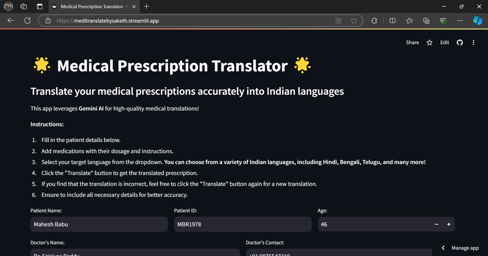
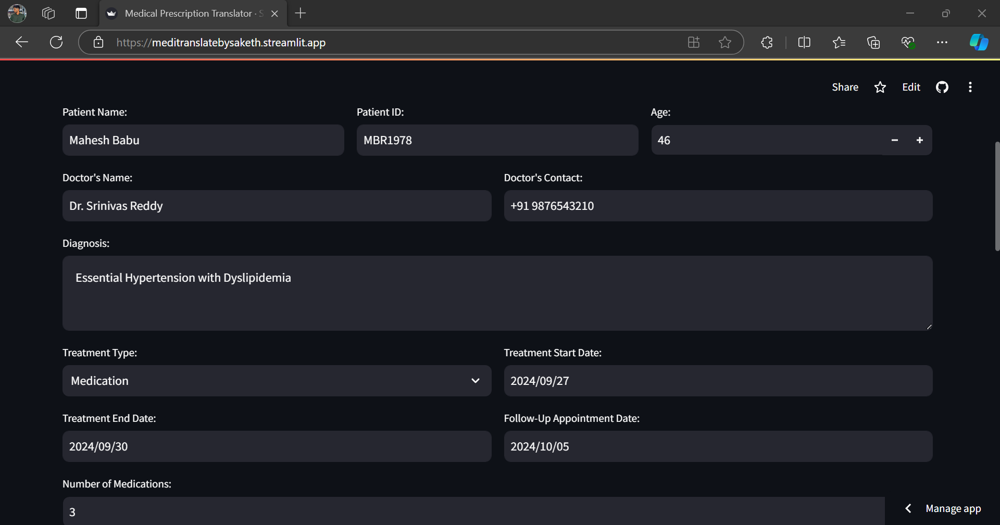
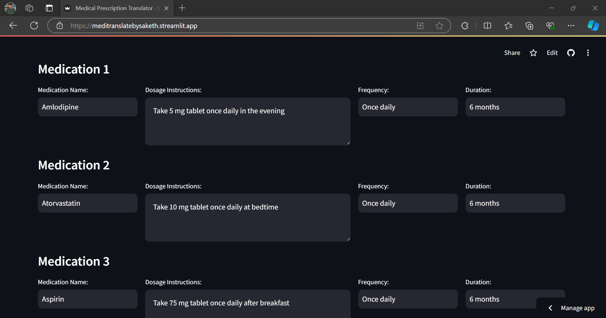
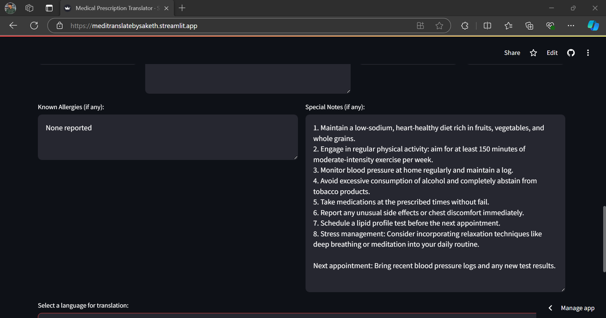
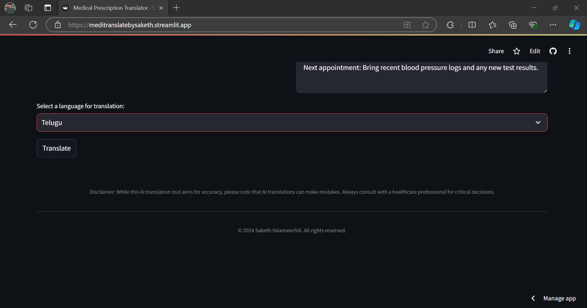
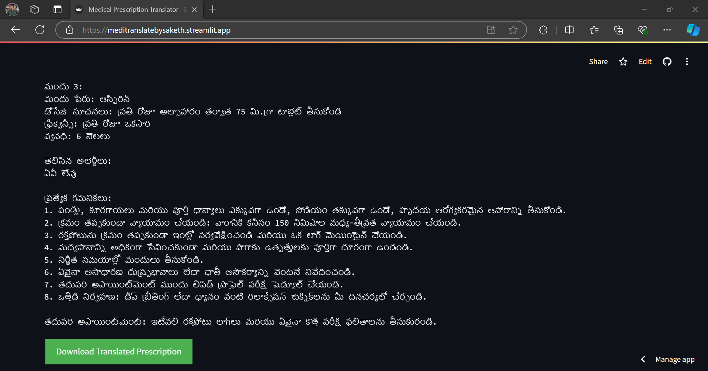

# Medical Prescription Translator

Medical Prescription Translator is a Streamlit-based web application that leverages Gemini AI to accurately translate medical prescriptions into various Indian languages. This tool is designed to bridge language barriers in healthcare, ensuring patients and healthcare providers can communicate effectively regardless of their native language.

## Features

- Translate medical prescriptions into multiple Indian languages
- User-friendly interface for inputting patient details and medication information
- Supports translation for multiple medications per prescription
- Includes fields for diagnosis, treatment details, and follow-up appointments
- Provides downloadable translated prescriptions
- Utilizes Gemini AI for high-quality medical translations

## Block Diagram


## Demo

Check out the live demo: [Medical Prescription Translator](https://meditranslatebysaketh.streamlit.app/)













## Installation and Setup

1. Clone the repository:
```bash

git clone https://github.com/sakethyalamanchili/Medical-Prescription-Translator.git

```

2. Navigate to the project directory:
```bash

cd medical-prescription-translator

```

3. Install the required dependencies:
```bash

pip install -r requirements.txt

```

4. Run the Streamlit app:
```bash

streamlit run app.py

```

## Usage

1. Fill in the patient details, including name, ID, and age.
2. Enter the doctor's information and diagnosis.
3. Add medication details, including name, dosage, frequency, and duration.
4. Select the target language for translation from the dropdown menu.
5. Click the "Translate" button to generate the translated prescription.
6. Download the translated prescription using the provided button.

## Technologies Used

- Python
- Streamlit
- Gemini AI
- Google Generative AI


### Sample Translated Prescription

You can find a sample translated prescription [here](translated_prescription_Telugu.txt).

